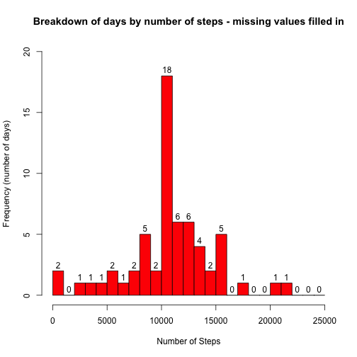

# Peer Assessment 1 Reproducible Research

### Loading the data

The first step I took was to load the data into R by reading the csv file and creating a data frame.


```r
data <- read.csv('activity.csv')
```

Next I looked at a quick summary of the data.


```r
summary(data)
```

```
##      steps                date          interval     
##  Min.   :  0.00   2012-10-01:  288   Min.   :   0.0  
##  1st Qu.:  0.00   2012-10-02:  288   1st Qu.: 588.8  
##  Median :  0.00   2012-10-03:  288   Median :1177.5  
##  Mean   : 37.38   2012-10-04:  288   Mean   :1177.5  
##  3rd Qu.: 12.00   2012-10-05:  288   3rd Qu.:1766.2  
##  Max.   :806.00   2012-10-06:  288   Max.   :2355.0  
##  NA's   :2304     (Other)   :15840
```

### What is the mean number of steps taken per day?

First we have to calculate the total number of steps taken per day. We are ignoring NAs (missing data) for now.


```r
completeData <- data[complete.cases(data),]
stepsPerDayData <- aggregate(completeData$steps, by = list(completeData$date), FUN = sum)
```

Next I make a histogram with bins for step numbers and frequency as the number of days. The default bins were too large so I reduced the bin size.


```r
bins <- 0:25 * 1000
hist(stepsPerDayData$x, breaks = bins, main = 'Breakdown of days by number of steps', xlab = 'Number of Steps', ylab = 'Frequency (number of days)', col = 'BLUE', labels = TRUE, ylim = c(0,15))
```

 

The mean and median total steps per day were calculated, making sure to ignore missing values.


```r
meanSPD <- mean(stepsPerDayData$x, na.rm=TRUE)
medianSPD <- median(stepsPerDayData$x, na.rm=TRUE)
```

From this we can see the mean is 1.0766189 &times; 10<sup>4</sup> and the median is 10765.

## What is the average daily activity patern?

Here we are finding the average steps in each 5 minute interval, averaged over all the days, and plotting that to see the 'Average Daily Activity Pattern'. We also are interested in which interval has, on average, the maximum number of steps.


```r
averageDayData <- aggregate(completeData$steps, by = list(completeData$interval), FUN = mean)
plot(averageDayData$x ~ averageDayData$Group.1, type = 'l', main = 'Average Daily Activity Pattern', xlab = 'Interval (time)', ylab = 'Number of steps')
```

 

```r
timeOfMax <- averageDayData[which.max(averageDayData$x),1]
```

So, on average, the maximum number of steps are taken in interval 835 during the day.

### Imputing missing values

Now we want to check how taking out the missing values may have affected the analysis. First we calculate the number of observations that are missing.


```r
numMissing <- length(which(is.na(data$steps)))
```

So there are 2304 observations missing data. I will create a new data set where the missing values are replaced with the daily average value for that time interval.


```r
newData <- merge(data, averageDayData, by.x="interval", by.y="Group.1")
newData[is.na(newData$steps),2] <- newData[is.na(newData$steps),4] 
    # column 2 is where missing values are and 4 is where average daily values are
newData <- newData[with(newData,order(date,interval)),]
```

Now I will make a histogram and calculate the mean and median steps per day with this new filled-in dataset.


```r
newStepsPerDayData <- aggregate(newData$steps, by = list(newData$date), FUN = sum)
bins <- 0:25 * 1000
hist(newStepsPerDayData$x, breaks = bins, main = 'Breakdown of days by number of steps - missing values filled in', xlab = 'Number of Steps', ylab = 'Frequency (number of days)', col = 'Red', labels = TRUE, ylim = c(0,20))
```

 

```r
newMeanSPD <- mean(newStepsPerDayData$x, na.rm=TRUE)
newMedianSPD <- median(newStepsPerDayData$x, na.rm=TRUE)
```

The new mean is 1.0766189 &times; 10<sup>4</sup> and the new median is 1.0766189 &times; 10<sup>4</sup>. We can see the mean steps per day has not changed since we filled in the missing values using an average day. The median has changed slightly, and is now closer to the mean, since there are many more days that are equal to an average day after filling in missing values. You can also see this in the histogram where the frequency of all but the middle bin (containing the mean value) have stayed the same, while the middle bin has increased quite a bit.

### Weekend vs. Weekday activity

Now we want to analyze whether the daily activity differs based on if it is a weekday or weekend. First we need to add a factor variable indicating if the date is a weekday or weekend. 


```r
newData$day <- factor(weekdays(as.Date(newData$date)) %in% c("Saturday","Sunday"), levels = c(TRUE,FALSE), labels = c("Weekend","Weekday"))
```

Finally, we find the average weekday day and average weekend day and plot on a 2 panel plot.


```r
averageWeekDayData <- aggregate(newData[newData$day == 'Weekday',]$steps, by = list(newData[newData$day == 'Weekday',]$interval), FUN = mean)
averageWeekEndData <- aggregate(newData[newData$day == 'Weekend',]$steps, by = list(newData[newData$day == 'Weekend',]$interval), FUN = mean)
par(mfrow = c(2,1), cex = 0.7, mar = c(1,1,1,1), oma =c(4,4,0.5,0.5))
plot(averageWeekDayData$x ~ averageWeekDayData$Group.1, type = 'l', main = 'Average Weekday Daily Activity Pattern', axes = FALSE)
axis(2)
plot(averageWeekEndData$x ~ averageWeekEndData$Group.1, type = 'l', main = 'Average Weekend Daily Activity Pattern', axes=FALSE)
axis(1)
mtext("Interval (time)", side=1, outer = TRUE, cex = 0.8, line = 2)
axis(2)
mtext("Number of Steps", side=2, outer = TRUE, cex = 0.8, line = 2)
```

 


